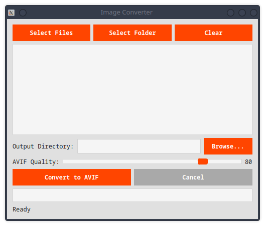

# ImagestoAVIF Converter

A lightweight, draganddrop GUI that converts PNG, JPEG, WebP, and other common formats to AVIF—delivering smaller file sizes without visible quality loss.

## Features
 Drag & drop or multiselect images 
 Realtime progress bar 
 Nonblocking UI—conversion runs in a background thread 
 Preserves transparency (PNG → AVIF with alpha) 
 Crossplatform (Windows, macOS, Linux)



## How It Works
| Component                         | Purpose                          |
| --------------------------------- | -------------------------------- |
| **PyQt6**                         | Modern, responsive GUI           |
| **Pillow**                        | Image loading & pre-processing   |
| **pillow-avif** + **imagecodecs** | Fast, high-quality AVIF encoding |

## Installation

1. **Clone the repo**
 ```bash
 git clone https://github.com/yourusername/ImagestoAvifConverter.git
 cd ImagestoAvifConverter
 ```

2. **Create & activate a virtual environment**
 ```bash
 python3 m venv venv
 source venv/bin/activate # Windows: venv\Scripts\activate
 ```

3. **Install dependencies**
 ```bash
 pip install r requirements.txt
 ```

4. **Run the app**
 ```bash
 python main.py
 ```

## Requirements
 Python ≥ 3.8,
 PyQt6,
 Pillow ≥ 9.2,
 pillowavifplugin.

## Example
| Original  | Size   | After AVIF | Size   | Savings |
| --------- | ------ | ---------- | ------ | ------- |
| photo.png | 2.4 MB | photo.avif | 480 KB | 80 %    |

## Contributing
Pull requests are welcome. Please open an issue first for major changes.